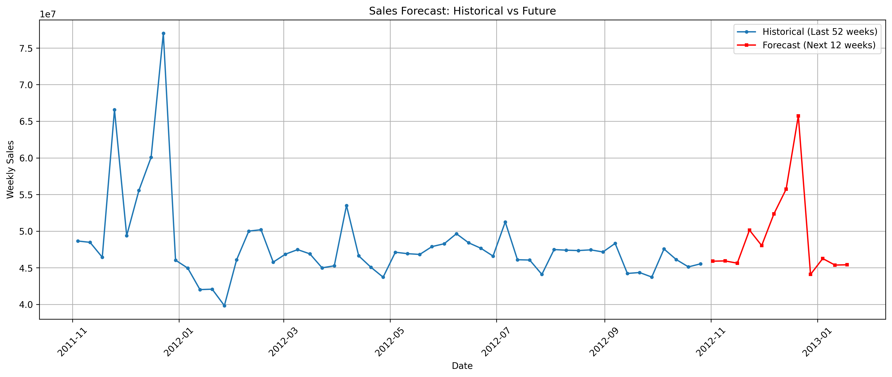

# Walmart Sales Forecasting

This project focuses on time series forecasting to predict weekly sales for various departments across different Walmart stores. The goal is to build an accurate machine learning model using historical sales data and external features, and then use that model to forecast sales for 12 weeks into the future.

## Project Pipeline

The project follows a standard machine learning workflow:
1.  **Data Loading & Cleaning:** The three datasets (`sales`, `features`, `stores`) were loaded, merged, and cleaned to handle missing values.
2.  **Feature Engineering:** New features were created from the data to help the model learn time-based patterns.
3.  **Data Preparation:** Categorical features were one-hot encoded and the data was split into training, validation, and test sets using a time-aware split.
4.  **Modeling & Selection:** Two models, Ridge Regression and LightGBM, were trained. The LightGBM model was selected for its superior performance on the validation set.
5.  **Evaluation:** The final LightGBM model was evaluated on the unseen test set to get an unbiased measure of its performance.
6.  **Forecasting:** An iterative forecasting loop was built to predict sales for 12 weeks beyond the dates available in the original dataset.

## Features Engineered

To capture the time series dynamics, the following features were engineered:
* **Date Components:** `Year`, `Month`, `WeekOfYear`
* **Lag Features:** Sales from the previous 1 to 7 weeks (`lag_1` to `lag_7`).
* **Rolling Average Features:** The 4-week and 13-week moving averages of sales (`rmean_4w`, `rmean_13w`).
* **Categorical Encoding:** One-hot encoded features for `Month` and store `Type`.

## Models Used

Two models were trained and compared:
* **Ridge Regression:** A linear model used as a performance baseline.
* **LightGBM:** A powerful gradient boosting model that was chosen for the final forecast due to its high accuracy and speed.

## Results

The final LightGBM model achieved the following performance on the unseen test set:
* **Mean Absolute Error (MAE):** $1,387.91
* **Root Mean Squared Error (RMSE):** $2,979.92

### Final Forecast Visualization

The plot below shows the historical sales followed by the 12-week forecast generated by the final model.



## How to Run

1.  **Clone the repository:**
    ```bash
    git clone https://github.com/Kh-NJ2/Walmart-Sales-Forecast.git
    ```
2.  **Install the required libraries:**
    ```bash
    pip install pandas numpy scikit-learn matplotlib seaborn lightgbm statsmodels
    ```
3.  **Place the datasets** (`train.csv`, `features.csv`, `stores.csv`) from the Kaggle competition into the root directory of the project.

4.  **Run the Jupyter Notebook:**
    Open and run the `Forecasting.ipynb` notebook.

## Technologies Used
* Python
* Pandas & NumPy
* Scikit-learn
* LightGBM
* Matplotlib & Seaborn
* Jupyter Notebook
